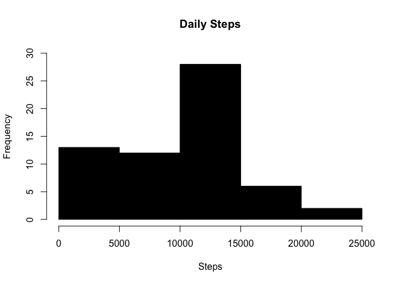
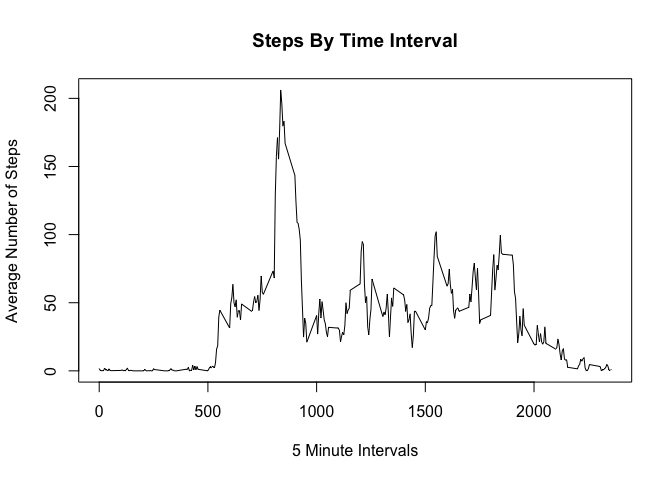
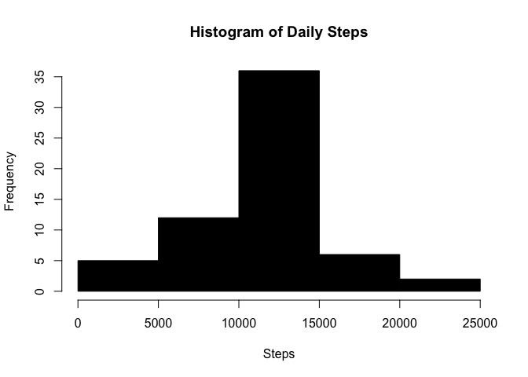
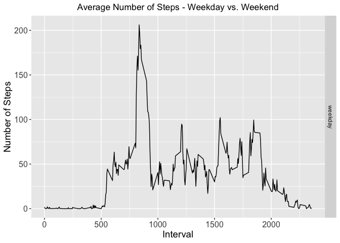

#**Introduction**

It is now possible to collect a large amount of data about personal movement using activity monitoring devices such as a Fitbit, Nike Fuelband, or Jawbone Up. These type of devices are part of the "quantified self" movement - a group of enthusiasts who take measurements about themselves regularly to improve their health, to find patterns in their behavior, or because they are tech geeks. But these data remain under-utilized both because the raw data are hard to obtain and there is a lack of statistical methods and software for processing and interpreting the data.

This assignment makes use of data from a personal activity monitoring device. This device collects data at 5 minute intervals through out the day. The data consists of two months of data from an anonymous individual collected during the months of October and November, 2012 and include the number of steps taken in 5 minute intervals each day.

The data for this assignment can be downloaded from the link below:

Dataset: Activity monitoring data [52K] 
Download Link: http://d396qusza40orc.cloudfront.net/repdata%2Fdata%2Factivity.zip

#**The variables included in this dataset are:**

- steps: Number of steps taking in a 5-minute interval (missing values are coded as NA)
- date: The date on which the measurement was taken in YYYY-MM-DD format
- interval: Identifier for the 5-minute interval in which measurement was taken
- The dataset is stored in a comma-separated-value (CSV) file and there are a total of 17,568 observations in this dataset.


#**Libraries used for this assignment**


```r
library(ggplot2)
library(dplyr)
```

```
## 
## Attaching package: 'dplyr'
```

```
## The following objects are masked from 'package:stats':
## 
##     filter, lag
```

```
## The following objects are masked from 'package:base':
## 
##     intersect, setdiff, setequal, union
```
#**Loading and preprocessing the data**


```r
if(!file.exists("./data")){dir.create("./data")}
fileUrl <- "https://d396qusza40orc.cloudfront.net/repdata%2Fdata%2Factivity.zip"
download.file(fileUrl,destfile="./data/activity.zip",method="curl")

unzip(zipfile="./data/activity.zip",exdir="./data")
activity <- read.csv("./data/activity.csv")
activity$date <- as.Date(activity$date)
```

#**What is mean total number of steps taken per day?**

```r
stepsPerDay <- activity %>%
  group_by(date) %>%
  summarise(sumsteps = sum(steps, na.rm = TRUE))
```

```r
hist(stepsPerDay$sumsteps, main = "Daily Steps", 
     col="black", xlab="Steps", ylim = c(0,30))
```

<!-- -->

```r
Mean <- round(mean(stepsPerDay$sumsteps),digits = 1)
print(paste("Mean is: ", Mean))
```

```
## [1] "Mean is:  9354.2"
```

```r
Median <- round(median(stepsPerDay$sumsteps),digits = 1)
print(paste("Median is: ", Median))
```

```
## [1] "Median is:  10395"
```

#**What is the average daily activity pattern?**


```r
stepsPerInterval <- activity %>%
  group_by(interval) %>%
  summarize(meansteps = mean(steps, na.rm = TRUE)) 

plot(stepsPerInterval$meansteps ~ stepsPerInterval$interval,
     col="black", type="l", xlab = "5 Minute Intervals", ylab = "Average Number of Steps",
     main = "Steps By Time Interval")
```

<!-- -->


```r
print(paste("Interval containing the most steps on average: "
            ,stepsPerInterval$interval[which.max(stepsPerInterval$meansteps)]))
```

```
## [1] "Interval containing the most steps on average:  835"
```


```r
print(paste("Average steps for that interval: ",round(max(stepsPerInterval$meansteps),digits=1)))
```

```
## [1] "Average steps for that interval:  206.2"
```

#**Impute missing values. Compare imputed to non-imputed data.**

```r
print(paste("The total number of rows with NA is: ",sum(is.na(activity$steps))))
```

```
## [1] "The total number of rows with NA is:  2304"
```


```r
activityNoNA <- activity  
for (i in 1:nrow(activity)){
  if(is.na(activity$steps[i])){
    activityNoNA$steps[i]<- stepsPerInterval$meansteps[activityNoNA$interval[i] == stepsPerInterval$interval]
  }
}

stepsPerDay <- activityNoNA %>%
  group_by(date) %>%
  summarize(sumsteps = sum(steps, na.rm = TRUE)) 
```


```r
hist(stepsPerDay$sumsteps, main = "Histogram of Daily Steps", 
     col="black", xlab="Steps")
```

<!-- -->


```r
meanPostNA <- round(mean(stepsPerDay$sumsteps), digits = 1)
print(paste("Mean post NA is: ", mean(meanPostNA)))
```

```
## [1] "Mean post NA is:  10766.2"
```


```r
medianPostNA <- round(median(stepsPerDay$sumsteps), digits = 1)
print(paste("Median post NA is: ", median(medianPostNA)))
```

```
## [1] "Median post NA is:  10766.2"
```


```r
NACompare <- data.frame(mean = c(Mean,meanPostNA),median = c(Median,medianPostNA))
rownames(NACompare) <- c("Pre NA ", "Post NA ")
print(NACompare)
```

```
##             mean  median
## Pre NA    9354.2 10395.0
## Post NA  10766.2 10766.2
```


#**Are there differences in activity patterns between weekdays and weekends?**

```r
activityDoW <- activityNoNA
activityDoW$date <- as.Date(activityDoW$date)
activityDoW$day <- ifelse(weekdays(activityDoW$date) %in% c("Saturday", "Sunday"), "weekend", "weekday")
activityDoW$day <- as.factor(activityDoW$day)
```


```r
activityWeekday <- filter(activityDoW, activityDoW$day == "weekday")
activityWeekend <- filter(activityDoW, activityDoW$day == "weekend")

activityWeekday <- activityWeekday %>%
        group_by(interval) %>%
        summarize(steps = mean(steps)) 
activityWeekday$day <- "weekday"

activityWeekend <- activityWeekend %>%
        group_by(interval) %>%
        summarize(steps = mean(steps)) 
activityWeekend$day <- "weekend"

wkdayWkend <- rbind(activityWeekday, activityWeekend)


g <- ggplot (wkdayWkend, aes (interval, steps))+ geom_line()  + 
        ggtitle("Average Number of Steps - Weekday vs. Weekend") +
        theme(axis.text = element_text(size = 12),axis.title = element_text(size = 14)) + 
        labs(y = "Number of Steps") + labs(x = "Interval") + 
        theme(plot.title = element_text(hjust = 0.5))
g + facet_grid (day~.)
```

<!-- -->
